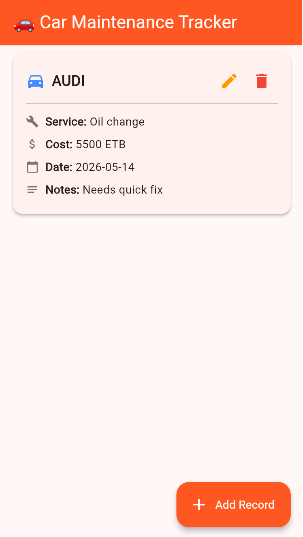
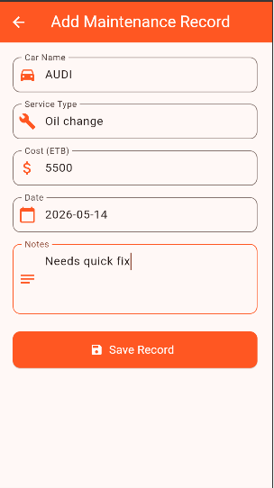
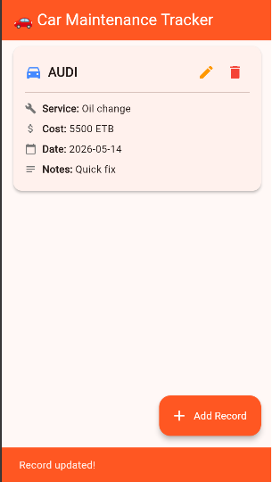
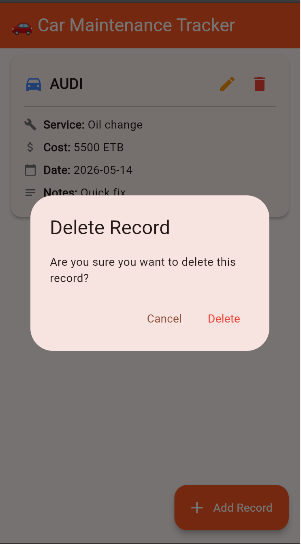

# Car Maintenance Tracker

A Flutter application that performs CRUD operations using
**HTTP** package and **Provider** state management.

## Description
This app allows users to track their car maintenance history.
Users can add service records, view all maintenance history,
update existing records, and delete old records.

## Tech Stack
- **State Management:** Provider
- **HTTP Client:** HTTP package
- **API:** MockAPI
- **Language:** Dart
- **Framework:** Flutter

## Features
-  Create new maintenance records
-  Read and display all records
-  Update existing records
-  Delete records
-  Loading states with spinner
-  Error handling with SnackBar
-  Clean architecture with Repository pattern

## API
Built with [MockAPI](https://mockapi.io)
**Base URL:** `https://6a09e92be7e3f433d48392be.mockapi.io/api/records`

## Screenshots

### Home Screen

### Add Record (Empty)

### Add Record (Filled)

### Edit Record

### Delete Record

